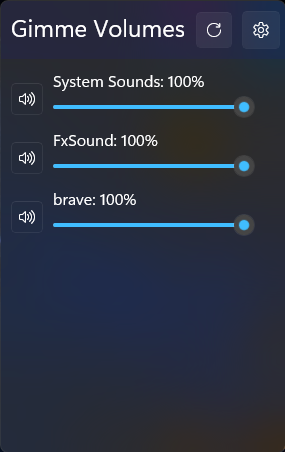
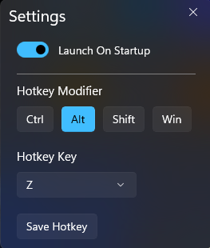

# Gimme Volumes

Gimme Volumes is a lightweight Windows desktop utility that lets you control audio sessions per application using a global hotkey. It's built with modern Windows technologies and designed for ease of use.

## Features

- 🔊 View and control volume of individual audio sessions
- 🎚 Change the global hotkey for showing the window
- 🚀 Option to launch the app at startup
- 📥 Tray icon for quick access to Settings or Exit
- 🪟 Uses WinUI 3 (Windows App SDK 1.7)
- 🧰 Built on .NET 8
- 🧠 Leverages NAudio for audio session processing
- 🖇 Uses `IWshRuntimeLibrary` for creating Windows startup shortcuts
- ⚙️ P/Invoke support via `Microsoft.Windows.CsWin32`
- 📦 Unpackaged app — no installer required

---

## Getting Started

1. **Download the latest release** from the [Releases](https://github.com/YOUR_USERNAME/Gimme-Volumes/releases) page.
2. Extract and run `Gimme Volumes.exe`.
3. Use the tray icon to open settings and configure your hotkey and preferences.

### Tray Icon

- 🛠 Settings
- ❌ Exit
- 🖱 Double-click to open main window

---

## Reduce Size (Optional)

To further reduce the app size, a Python script (`clean_unused.py`) is provided to delete unnecessary DLLs and folders. Just drop it into the EXE directory and run it.

> ⚠️ **Use at your own risk.** Make sure you back up important files.

---

## Development

### Requirements

- Visual Studio 2022
- .NET 8 SDK
- Windows App SDK 1.7 workload
- Windows 10/11

---

## Author

Created by [@YourUsername](https://github.com/YourUsername).
